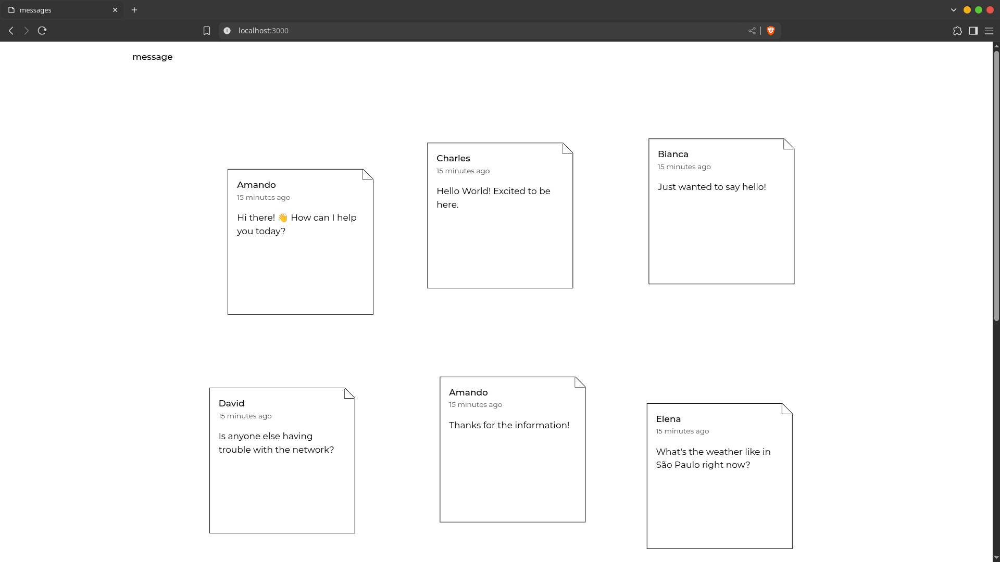

# Mini Message Board

<div align='center'>
  <a href='./README.md'>
    [EN-US]
  </a>
</div>

<br>

Uma aplicação simples e intuitiva de mural de mensagens construída com Node.js e Express, permitindo que usuários postem e visualizem mensagens em uma interface minimalista.



## Funcionalidades

- Criar e postar mensagens
- Visualizar todas as mensagens em ordem cronológica
- Interface de usuário limpa e responsiva
- Validação de formulários
- Integração com banco de dados PostgreSQL

## Tecnologias

- Node.js
- Javascript
- Express
- EJS
- PostgreSQL
- Express Validator

## Instalação

### Pré-requisitos:

- Node.js instalado
- PostgreSQL instalado

<br>

1. Clone este repositório

```bash
git clone https://github.com/thomasmfx/mini-message-board.git
```

2. Instale as dependências

```bash
npm install
```

3. Adicione um arquivo `.env` na raiz do projeto. Em seguida, adicione o número da porta desejada e a URL do seu banco de dados local

```js
PORT=<número-da-porta>
DATABASE_URL=<url-do-banco-de-dados-local>
```

> [!NOTA]
> A URL do banco de dados deve seguir este formato: `postgresql://<usuário>:<senha>@localhost:<porta>/<banco-de-dados>`


4. Popule o banco de dados (este script foi projetado para ser executado apenas uma vez)

```bash
npm run seed
```

5. Inicie o servidor de desenvolvimento

```bash
npm run dev
```

Se tudo ocorrer bem, você deve ser capaz de abrir a aplicação na URL exibida no terminal.

## Contato

Se você tiver alguma dúvida, sugestão ou apenas quiser se conectar, sinta-se à vontade para entrar em contato:

- **Email:** thomasmoisesf@gmail.com
- **LinkedIn:** [Thomas Moisés](https://www.linkedin.com/in/thomas-moises-fernandes/)
- **GitHub:** [thomasmfx](https://github.com/thomasmfx)

***

<p align='center'>
  <em>
    "The calmer you are, the clearer you think."
  </em>
</p>
