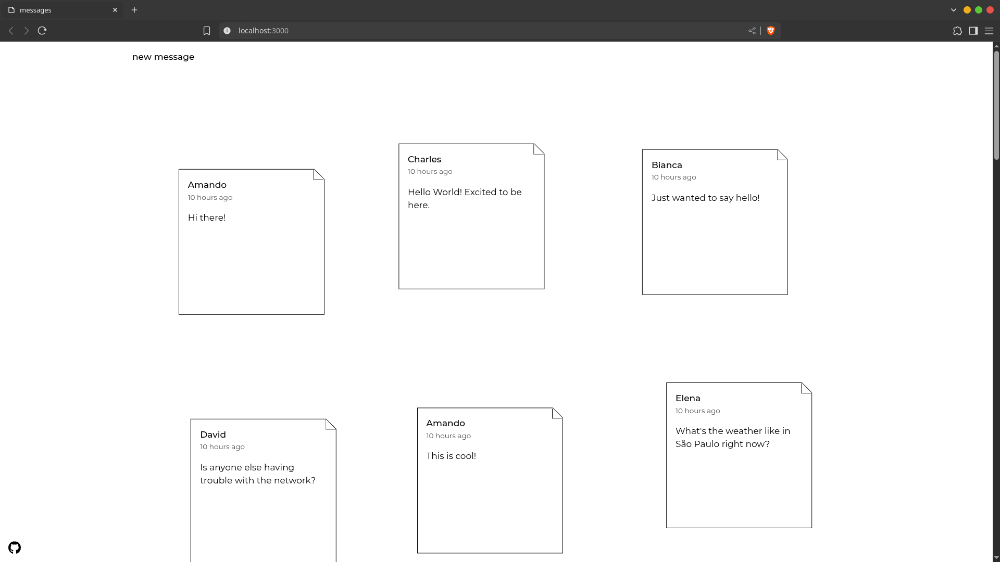

# Mini Message Board

  <a href='./README.md'>
    EN-US 
  </a>

 

Uma aplicação simples e intuitiva de mural de mensagens construída com Node.js e Express, permitindo que usuários postem
e visualizem
mensagens em uma interface minimalista.

## 🚀 Funcionalidades

- Criar e postar mensagens
- Visualizar todas as mensagens em ordem cronológica
- Interface limpa e responsiva
- Validação de formulário no backend
- Integração com banco de dados PostgreSQL

## 👨🏽‍💻 Tecnologias

- Node.js
- Javascript
- Express
- EJS
- PostgreSQL
- Express Validator

## ☕ Contato

Se você tiver alguma dúvida, sugestão ou quiser se conectar, sinta-se à vontade para entrar em contato:

- **Email:** thomasmoisesf@gmail.com
- **LinkedIn:** [Thomas Moisés](https://www.linkedin.com/in/thomas-moises-fernandes/)
- **GitHub:** [thomasmfx](https://github.com/thomasmfx)

